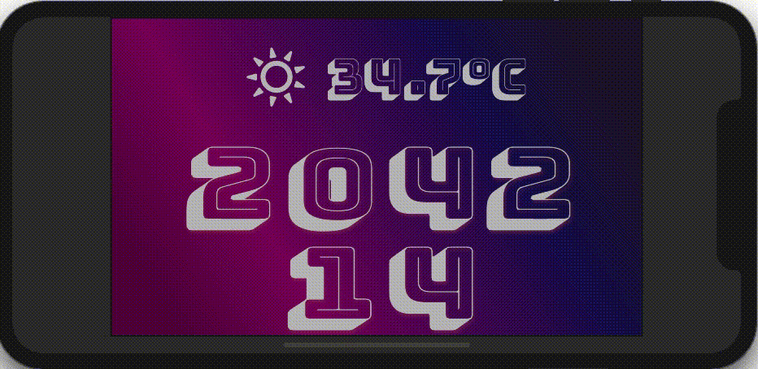
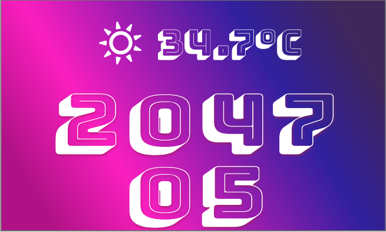
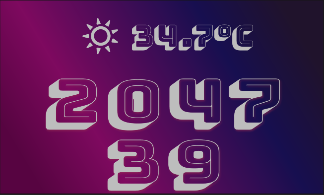

# Synth Wave Clock

This app is a submission for the Flutter Clock challenge (flutter.dev/clock).

It features a clock based on a synth wave theme with morphing letters.

Featuring:
 * OFL font BungeeShade
 * OFL font WeatherIcons
 * text_to_path_maker
 * path_morph
 * flutter_svg

